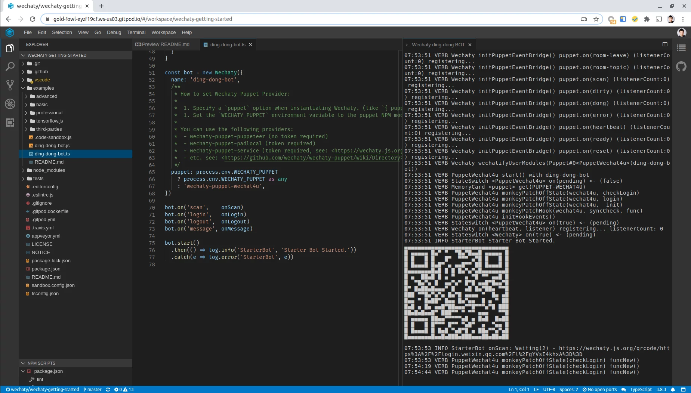

# 👇 **Click me**

Click the ☝️ above `[Gitpod | Ready-to-Code]` button to launch Gitpod with Wechaty Getting Started ding-dong BOT instantly inside your favorite browser.

The button will take you to this link: <https://gitpod.io/#https://github.com/wechaty/getting-started>

GitHub links:

- Repo: <https://github.com/wechaty/getting-started/blob/master/docs/gitpod.md>
- Pages <https://wechaty.github.io/wechaty-getting-started/docs/gitpod>

## Screenshot

You can [join our Gitter](https://gitter.im/wechaty/wechaty) network if you aren’t already a member.

> Wechaty ❤️ Gitpod

## What is Gitpod

> Gitpod is an online IDE which can be launched from any GitHub page. Simply prefix any GitHub-URL with “<https://gitpod.io#>” or use our browser extension that adds a button to GitHub pages.
>
> Within seconds, Gitpod provides you with a fully working development environment, including a VS Code-powered IDE and a cloud-based Linux container configured specifically for the project at hand.
>
> &mdash; [Gitpod — Online IDE For GitHub](https://medium.com/gitpod/gitpod-gitpod-online-ide-for-github-6296b907a886)

[Here](https://stackoverflow.com/a/63595356/1123955) has a Stackoverflow answer from Gitpod co-founder Moriz Eysholdt.

## What is Wechaty

[Wechaty](https://github.com/wechaty/wechaty/) is a Conversational RPA SDK for Chatbot Makers. It's well designed with an easy to use API, supports all OSs including Linux, OSX, Win32, Docker, and lots of IMs including WeChat, WeCom, Whatsapp, Lark, Gitter, etc.

## What is Wechaty Getting Started

[Wechaty Getting Started](https://github.com/wechaty/getting-started) is a repository that work out-of-the-box, which is the best start point for Wechaty beginners.

As a developer, you can use Wechaty to easily build your bot, effectively manage message sending/receiving, room creating/inviting, contact friendship, and delightful add artificial intelligence between users and your bot.

- GitHub: <https://github.com/wechaty/getting-started>
- `ding-dong-bot.ts`: <https://github.com/wechaty/getting-started/blob/master/examples/ding-dong-bot.ts>

## Maintainers

[@wechaty/contributors](https://github.com/orgs/wechaty/teams/contributors/members)

## Copyright & License

- Code & Docs © 2018-now Huan and Wechaty Community Contributors (<https://github.com/wechaty>)
- Code released under the Apache-2.0 License
- Docs released under Creative Commons
